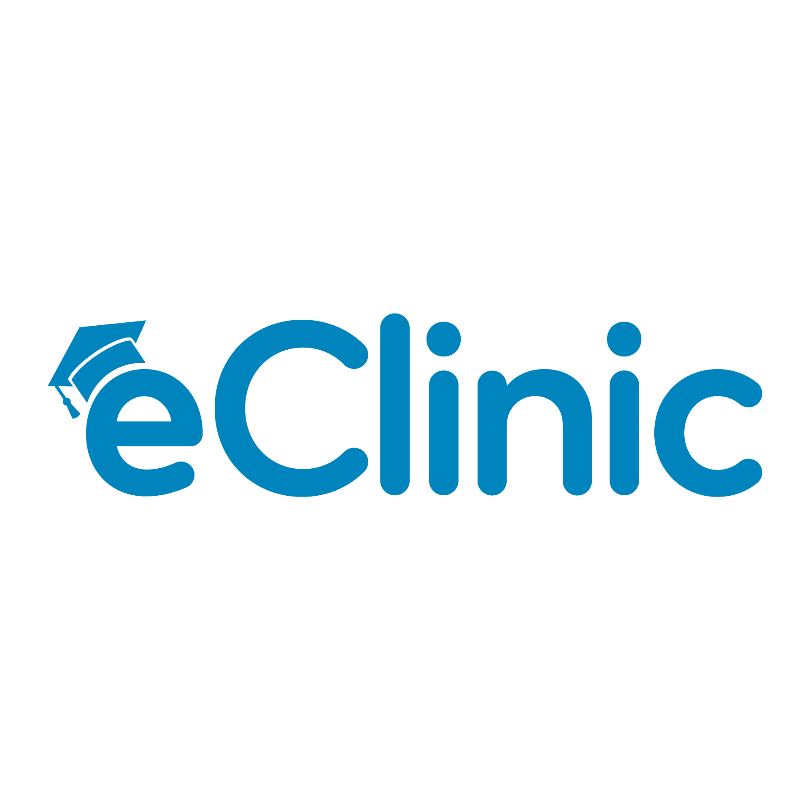

<!-- PROJECT LOGO -->

  

<!-- TABLE OF CONTENTS -->

  
Table of Contents

  <ol>
    <li>
      <a href="#about-the-project">About The Project</a>
      <ul>
        <li><a href="#built-with">Built With</a></li>
      </ul>
    </li>
    <li>
      <a href="#getting-started">Getting Started</a>
      <ul>
        <li><a href="#prerequisites">Prerequisites</a></li>
        <li><a href="#installation">Installation</a></li>
        <li><a href="#start-the-web-portal">Start the web portal</a></li>
      </ul>
    </li>
  </ol>

<!-- ABOUT THE PROJECT -->
## About The Project
The aim of the eClinic system is to have a technological system, that enhances the guidance process for both students and faculty members in CCIS at KSU to resolve the graduation project issues more efficiently and effectively.
<!-- 
(<a href="#readme-top">back to top</a>)
 -->

### Built With

<!-- GETTING STARTED -->
## Getting Started

### Prerequisites

* Visual Studio Code.
* Localhost server (you can use live server extention in vs).
* Cloud Firestore account (for this project we are already created an account) .

### Installation
to be able to open and view the code you should download a code editor like VS code.

1. Get VS code from her [https://code.visualstudio.com](https://code.visualstudio.com/download)
2. Download [live server](https://marketplace.visualstudio.com/items?itemName=ritwickdey.LiveServer) from VS code extensions (if needed).
3. Download the code zip folder and open it in VS code

After that you will be able so view the code and the web portal !!.
 
### Start the web portal

1. Make sure you've downloaded all eClinic files
2. You can just double click on the html file, it will open in the browsers, BUT we recommend you to run the file on the local host or the live server. 
3. Start run with login file.

